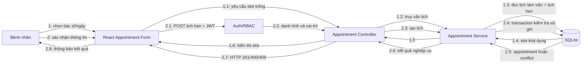

# Collaboration Diagram - Đặt lịch khám nha khoa

Sơ đồ giao tiếp (communication/collaboration) tập trung vào các đối tượng và thông điệp đánh số trong ca sử dụng đặt lịch.

## Trách nhiệm đối tượng

| Đối tượng | Trách nhiệm |
|---|---|
| React Appointment Form | Thu thập dữ liệu, kiểm tra cơ bản và hiển thị phản hồi |
| Auth/RBAC | Xác thực JWT và chặn vai trò không được phép |
| Appointment Controller | Chuẩn hóa request/response HTTP |
| Appointment Service | Áp dụng quy tắc lịch làm việc, thời gian và chuyển trạng thái |
| SQLite | Lưu bền vững và đảm bảo không trùng lịch bằng transaction/constraint |

