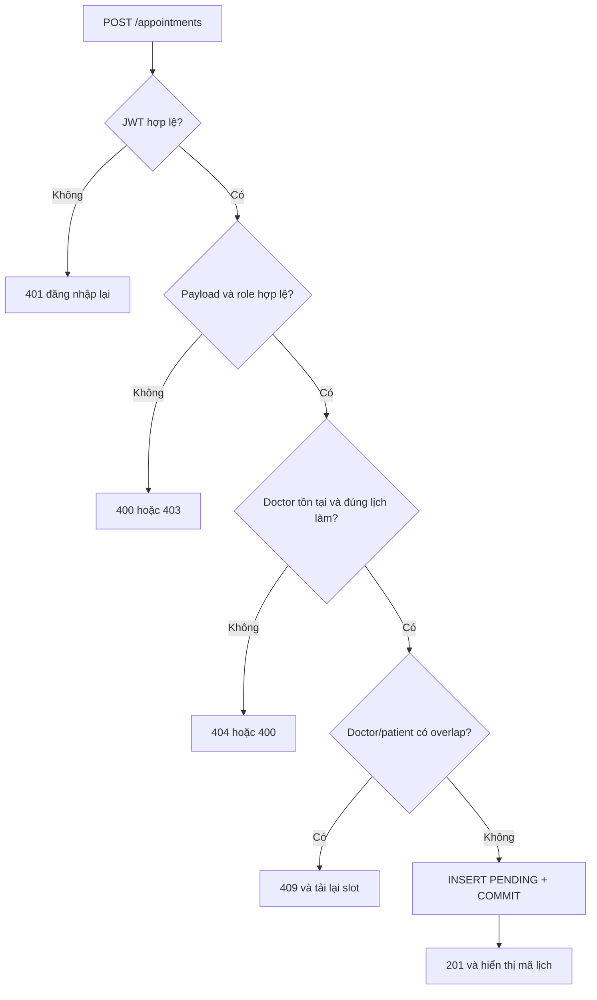

# Collaboration Diagram — Đặt lịch khám nha khoa

## 1. Mục tiêu

Collaboration/Communication Diagram mô tả các đối tượng tham gia và thứ tự thông điệp khi bệnh nhân đặt lịch. Khác Sequence Diagram tập trung vào trục thời gian, sơ đồ này nhấn mạnh đối tượng nào chịu trách nhiệm cho từng quyết định.

## 2. Các đối tượng

| Ký hiệu | Đối tượng | Trách nhiệm |
|---|---|---|
| `patient` | Bệnh nhân | Chọn bác sĩ, ngày, slot, nhập lý do và xác nhận |
| `bookingUI` | React Booking Page | Thu thập dữ liệu, validation cơ bản, hiển thị loading/error/success |
| `apiClient` | Frontend API Client | Gắn base URL, JWT, JSON header; chuẩn hóa lỗi HTTP |
| `auth` | Auth/RBAC Middleware | Xác minh JWT, user active và role |
| `controller` | Appointment Controller | Validate request và chuyển đổi HTTP sang nghiệp vụ |
| `service` | Appointment Service | Áp dụng lịch làm việc, quyền sở hữu, xung đột và transaction |
| `doctorRepo` | Doctor Repository | Đọc bác sĩ/lịch làm việc |
| `appointmentRepo` | Appointment Repository | Tìm overlap và lưu lịch |
| `db` | SQLite Database | Foreign key, constraint, transaction và lưu bền vững |

## 3. Collaboration Diagram

```mermaid
flowchart LR
    P["patient:Bệnh nhân"]
    UI["bookingUI:React Page"]
    CLIENT["apiClient:API Client"]
    AUTH["auth:JWT/RBAC"]
    CTRL["controller:Appointment Controller"]
    SVC["service:Appointment Service"]
    DR["doctorRepo:Doctor Repository"]
    AR["appointmentRepo:Appointment Repository"]
    DB[("db:SQLite")]

    P -->|"1: chọn bác sĩ và ngày"| UI
    UI -->|"1.1: getAvailability"| CLIENT
    CLIENT -->|"1.2: GET availability + JWT"| AUTH
    AUTH -->|"1.3: request đã xác thực"| CTRL
    CTRL -->|"1.4: getAvailableSlots"| SVC
    SVC -->|"1.5: getDoctorSchedule"| DR
    DR -->|"1.5.1: SELECT schedule"| DB
    DB -->|"1.5.2: schedule"| DR
    SVC -->|"1.6: findBusyAppointments"| AR
    AR -->|"1.6.1: SELECT active appointments"| DB
    DB -->|"1.6.2: busy ranges"| AR
    SVC -->|"1.7: available slots"| CTRL
    CTRL -->|"1.8: 200 slots"| CLIENT
    CLIENT -->|"1.9: render slots"| UI

    P -->|"2: chọn slot và xác nhận"| UI
    UI -->|"2.1: validate form"| UI
    UI -->|"2.2: createAppointment"| CLIENT
    CLIENT -->|"2.3: POST appointments + JWT"| AUTH
    AUTH -->|"2.4: req.user"| CTRL
    CTRL -->|"2.5: validate payload"| CTRL
    CTRL -->|"2.6: createAppointment user,input"| SVC
    SVC -->|"2.7: BEGIN IMMEDIATE"| DB
    SVC -->|"2.8: verify doctor/schedule"| DR
    DR -->|"2.8.1: SELECT"| DB
    SVC -->|"2.9: findDoctorOverlap"| AR
    AR -->|"2.9.1: SELECT overlap"| DB
    SVC -->|"2.10: findPatientOverlap"| AR
    AR -->|"2.10.1: SELECT overlap"| DB
    SVC -->|"2.11: insert PENDING"| AR
    AR -->|"2.11.1: INSERT"| DB
    SVC -->|"2.12: COMMIT hoặc ROLLBACK"| DB
    SVC -->|"2.13: appointment hoặc domain error"| CTRL
    CTRL -->|"2.14: HTTP 201 hoặc 4xx"| CLIENT
    CLIENT -->|"2.15: result/error"| UI
    UI -->|"2.16: thông báo kết quả"| P
```

## 4. Đánh số thông điệp chi tiết

| Số | Sender → Receiver | Nội dung | Kết quả mong đợi |
|---:|---|---|---|
| 1 | patient → bookingUI | Chọn bác sĩ/ngày | UI có điều kiện tìm slot |
| 1.1–1.4 | UI → service | Yêu cầu slot qua API/auth/controller | Request hợp lệ và có danh tính |
| 1.5 | service → doctorRepo | Đọc lịch làm việc | Biết giờ làm/độ dài slot |
| 1.6 | service → appointmentRepo | Đọc khoảng thời gian bận | Biết slot phải loại |
| 1.7–1.9 | service → patient | Trả và hiển thị slot | Người dùng chọn được giờ |
| 2 | patient → bookingUI | Xác nhận đặt | Có dữ liệu form |
| 2.1 | bookingUI → bookingUI | Kiểm tra client | Chặn lỗi hiển nhiên |
| 2.2–2.6 | UI → service | POST, auth, validate | Input nghiệp vụ đã chuẩn hóa |
| 2.7 | service → db | Mở transaction | Ngăn race condition khi ghi |
| 2.8–2.10 | service → repositories | Kiểm tra bác sĩ và hai loại conflict | Chỉ tiếp tục nếu hợp lệ |
| 2.11 | service → appointmentRepo | Lưu lịch PENDING | Nhận appointment ID |
| 2.12 | service → db | Commit/rollback | Atomicity |
| 2.13–2.16 | service → patient | Domain result thành HTTP thành UI | Hiển thị đúng thành công/lỗi |

## 5. Nhánh lỗi trong collaboration

## 6. Phân bổ trách nhiệm đúng kiến trúc

- UI không truy cập database, không tự cấp quyền và không tự quyết định slot cuối cùng.
- Controller không chứa SQL hoặc công thức nghiệp vụ; chỉ validate và ánh xạ HTTP.
- Service là nơi duy nhất điều phối transaction và quy tắc đặt lịch.
- Repository chỉ truy vấn/lưu; không trả HTTP response.
- Database là lớp bảo vệ cuối bằng foreign key, check/index/constraint.
- API Client không nuốt lỗi; phải chuyển status/body cho màn hình xử lý.

## 7. Liên hệ 13 yêu cầu

Ca sử dụng đặt lịch trực tiếp bao phủ yêu cầu 2 và 3, dùng xác thực từ yêu cầu 1, tạo đầu vào cho tiếp nhận/khám ở yêu cầu 4–5 và được tái sử dụng cho tái khám ở yêu cầu 12. Các yêu cầu 6–11 và 13 không nên nhét vào cùng Collaboration Diagram vì sẽ làm sai phạm vi của đề “Đặt lịch khám”; chúng được mô tả đầy đủ trong `SYSTEM_ANALYSIS.md` và `API_CONTRACT.md`.

