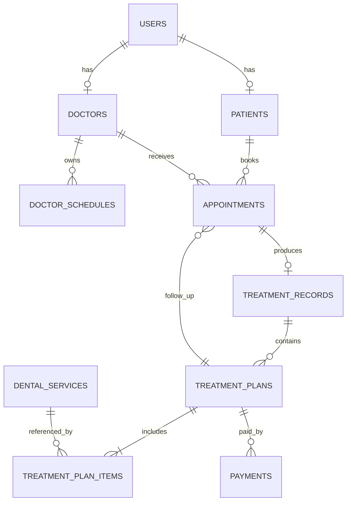

# Thiết kế cơ sở dữ liệu

## 1. Quan hệ tổng quát

## 2. Bảng và cột cốt lõi

### `users`

`id`, `email UNIQUE`, `password_hash`, `full_name`, `phone`, `role`, `active`, `created_at`, `updated_at`.

`role` chỉ nhận `ADMIN`, `RECEPTIONIST`, `DOCTOR`, `PATIENT`.

### `patients`

`id`, `user_id UNIQUE FK users`, `date_of_birth`, `address`, `medical_notes`.

### `doctors`

`id`, `user_id UNIQUE FK users`, `specialty`, `room`.

### `doctor_schedules`

`id`, `doctor_id`, `weekday` (0–6), `start_time`, `end_time`, `slot_minutes`, `active`.

Ràng buộc: `start_time < end_time`, `slot_minutes > 0`.

### `appointments`

`id`, `patient_id`, `doctor_id`, `start_at`, `end_at`, `reason`, `status`, `created_by`, `checked_in_by`, `checked_in_at`, `cancellation_reason`, `parent_plan_id`, `created_at`, `updated_at`.

Trạng thái: `PENDING`, `CONFIRMED`, `CHECKED_IN`, `IN_PROGRESS`, `COMPLETED`, `CANCELLED`, `NO_SHOW`.

### `dental_services`

`id`, `code UNIQUE`, `name`, `unit_price`, `active`, `created_at`, `updated_at`.

Không xóa cứng dịch vụ đã dùng; đổi `active = 0`.

### `treatment_records`

`id`, `appointment_id UNIQUE`, `patient_id`, `doctor_id`, `symptoms`, `diagnosis`, `notes`, `status`, `created_at`, `updated_at`.

### `treatment_plans`

`id`, `record_id`, `patient_id`, `doctor_id`, `discount_percent`, `subtotal`, `total`, `status`, `notes`, `patient_decided_at`, `created_at`, `updated_at`.

Trạng thái: `PENDING_PATIENT`, `ACCEPTED`, `REJECTED`, `PARTIALLY_PAID`, `PAID`, `COMPLETED`, `CANCELLED`. Nếu code hiện tại dùng tập nhỏ hơn thì migration và API phải cập nhật cùng lúc.

### `treatment_plan_items`

`id`, `plan_id`, `service_id`, `tooth_area`, `quantity`, `unit_price`, `line_total`, `notes`.

`unit_price` là snapshot, không tự đổi khi bảng dịch vụ thay giá.

### `payments`

`id`, `plan_id`, `amount`, `method`, `status`, `transaction_ref`, `received_by`, `created_at`.

Trạng thái: `COMPLETED`, `REFUNDED`; phương thức: `CASH`, `CARD`, `TRANSFER`.

## 3. Index bắt buộc

- `appointments(doctor_id, start_at, end_at)` để tìm xung đột bác sĩ.
- `appointments(patient_id, start_at, end_at)` để tìm xung đột bệnh nhân và lịch sử.
- `treatment_records(patient_id, created_at)`.
- `treatment_plan_items(plan_id)`.
- `payments(plan_id, status)`.
- Unique `users(email COLLATE NOCASE)` và `dental_services(code COLLATE NOCASE)`.

## 4. Transaction bắt buộc

1. Đăng ký: tạo `users` + `patients`.
2. Đặt lịch: bắt đầu transaction khóa ghi, kiểm tra xung đột, insert lịch.
3. Lập kế hoạch: tạo plan + toàn bộ items + tổng tiền.
4. Xác nhận: khóa plan, kiểm tra trạng thái, cập nhật plan + record.
5. Thanh toán: khóa plan, tính tổng đã trả, insert payment + cập nhật trạng thái.
6. Tái khám: kiểm tra kế hoạch + xung đột rồi insert lịch có `parent_plan_id`.

## 5. Quy ước dữ liệu

- ID là số nguyên dương; API không dùng email/tên làm khóa liên kết.
- Ngày giờ lưu UTC ISO 8601; ngày sinh lưu `YYYY-MM-DD`.
- Tiền là integer VND; không sử dụng `float` cho `unit_price`, `total`, `amount`.
- Dùng snake_case trong database, camelCase trong JSON và ánh xạ rõ tại repository/controller.
- Bật `PRAGMA foreign_keys = ON`, WAL và `busy_timeout` khi dùng SQLite.

