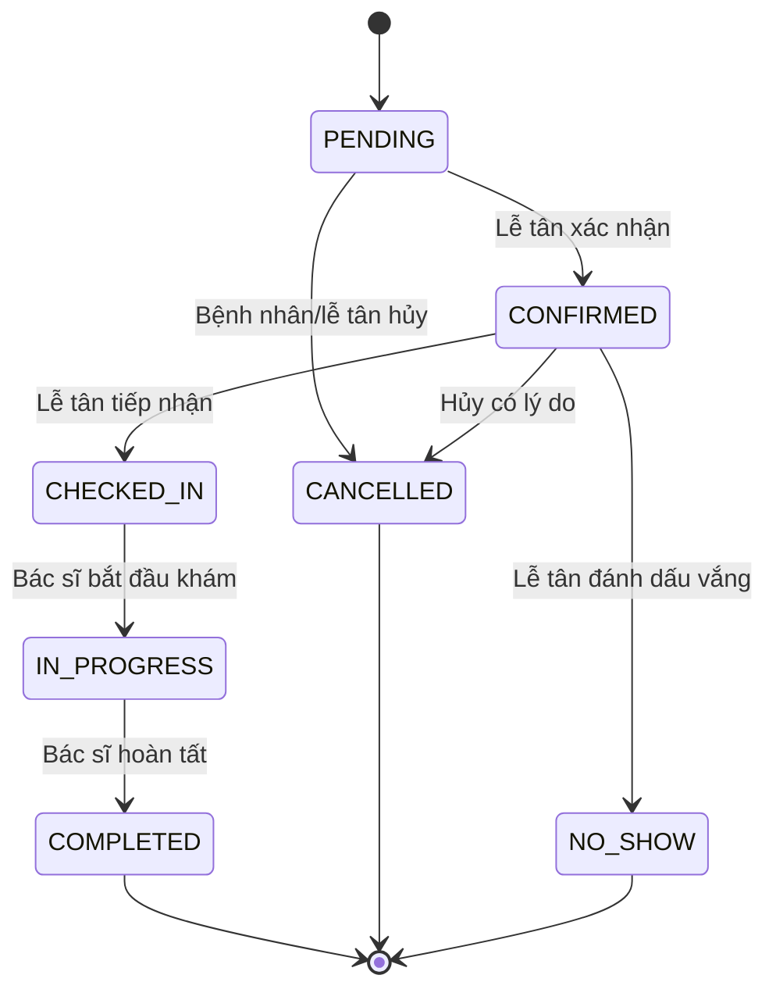
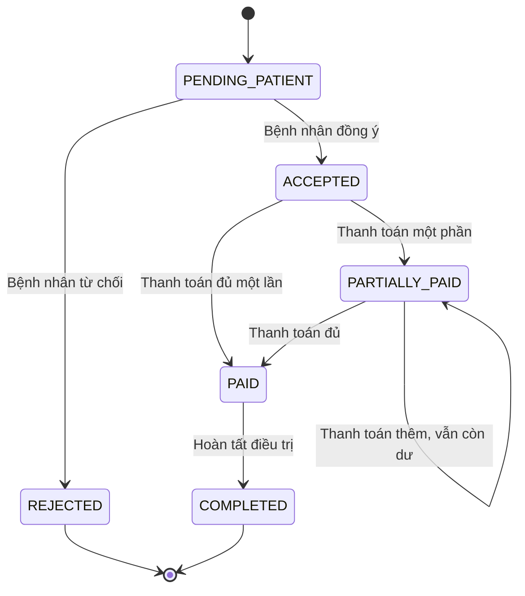

# Logic và phân quyền — Bản tra cứu nhanh

Tài liệu này là bản tóm tắt. Phân tích đầy đủ nằm trong [SYSTEM_ANALYSIS.md](./SYSTEM_ANALYSIS.md); endpoint chuẩn nằm trong [API_CONTRACT.md](./API_CONTRACT.md).

## Ma trận quyền

| Chức năng | PATIENT | RECEPTIONIST | DOCTOR | ADMIN |
|---|:---:|:---:|:---:|:---:|
| Đăng ký bệnh nhân | Chính mình | Tạo/hỗ trợ | Không | Có |
| Xem bác sĩ và slot | Có | Có | Có | Có |
| Đặt/hủy lịch | Của mình | Đặt thay | Không | Có |
| Xác nhận/check-in/no-show | Không | Có | Xem lịch mình | Có |
| Khám và chẩn đoán | Xem theo phạm vi | Không | Ca được giao | Giám sát |
| Chỉ định dịch vụ/kế hoạch | Xem | Không | Hồ sơ mình khám | Giám sát |
| Quản lý dịch vụ/đơn giá | Không | Xem | Xem | Có |
| Xác nhận điều trị | Plan của mình | Không | Không quyết định thay | Giám sát |
| Ghi nhận thanh toán | Xem/trả của mình | Có | Không | Có |
| Đặt tái khám | Yêu cầu của mình | Có | Ca mình điều trị | Có |
| Xem lịch sử | Của mình | Phạm vi phục vụ | Bệnh nhân mình điều trị | Có |

Frontend chỉ dùng role để dựng giao diện. Backend phải kiểm tra lại role, quyền sở hữu và trạng thái cho mọi request.

## Máy trạng thái lịch hẹn



Không được bỏ qua bước, ví dụ `PENDING -> COMPLETED` hoặc `CONFIRMED -> IN_PROGRESS`.

## Máy trạng thái kế hoạch/thu tiền



## Công thức chi phí

```text
lineTotal_i = unitPrice_i × quantity_i
subtotal = tổng lineTotal_i
discount = subtotal × discountPercent / 100
total = subtotal - discount
paid = tổng payment có status COMPLETED
remaining = total - paid
```

- Lưu tiền bằng integer VND.
- `quantity` là số nguyên dương, `discountPercent` từ 0 đến 100.
- Đơn giá được snapshot vào item khi lập plan.
- Server tự tính toàn bộ; không nhận `subtotal`, `total`, `remaining` từ frontend.
- Transaction chặn hai payment đồng thời làm `paid > total`.

## Quy tắc đặt lịch

- Thời điểm bắt đầu ở tương lai, kết thúc sau bắt đầu và nằm trong lịch làm việc.
- Bác sĩ và bệnh nhân không được có lịch overlap đang hiệu lực.
- Công thức overlap: `existing.start < requested.end AND existing.end > requested.start`.
- `CANCELLED` và `NO_SHOW` không chiếm slot.
- PATIENT đặt cho chính mình; RECEPTIONIST/ADMIN mới được gửi `patientId`.
- Availability phải được kiểm tra lại trong transaction khi insert.

## Quy tắc sở hữu dữ liệu

- Bệnh nhân được suy ra từ `req.user.id`, không tin ID tùy ý do client gửi.
- Bác sĩ chỉ thao tác appointment/record có `doctor_id` khớp profile của mình.
- Bệnh nhân chỉ quyết định và thanh toán plan có `patient_id` khớp profile.
- Lễ tân không được sửa chẩn đoán hoặc chỉ định y khoa.
- Không API nào trả `password_hash`.

## HTTP status thống nhất

| Status | Dùng khi |
|---:|---|
| 200/201 | Đọc/sửa thành công hoặc tạo mới |
| 400 | Payload, thời gian, số tiền hoặc trạng thái nhập sai |
| 401 | Thiếu/token không hợp lệ |
| 403 | Đã đăng nhập nhưng sai role/quyền sở hữu |
| 404 | Không tìm thấy tài nguyên trong phạm vi được phép |
| 409 | Trùng email, trùng lịch, đã quyết định hoặc conflict trạng thái |

## Chuỗi nghiệp vụ để kiểm tra

```text
PATIENT đăng ký/đặt lịch
-> RECEPTIONIST xác nhận/check-in
-> DOCTOR bắt đầu khám/lập hồ sơ/lập kế hoạch
-> PATIENT đồng ý
-> PATIENT hoặc RECEPTIONIST thanh toán
-> DOCTOR/RECEPTIONIST đặt tái khám
-> PATIENT xem lịch sử
```

