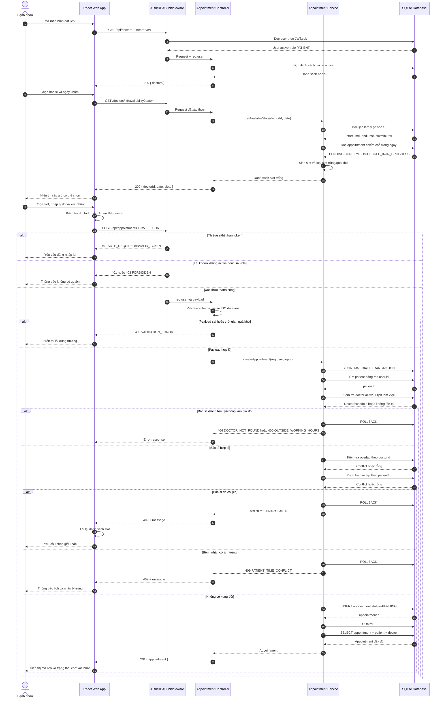
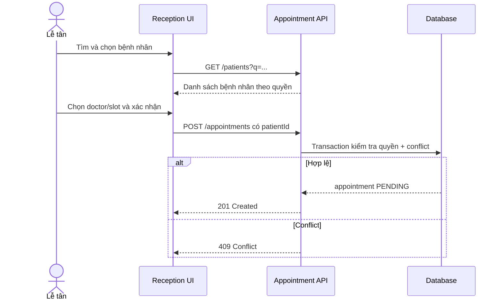

# Sequence Diagram — Đặt lịch khám nha khoa

## 1. Mục tiêu và phạm vi

Ca sử dụng mô tả bệnh nhân đã có tài khoản tìm slot và đặt lịch cho chính mình. Sơ đồ thể hiện đầy đủ frontend, xác thực/phân quyền, controller, service và database. Trường hợp lễ tân đặt thay dùng cùng service nhưng được phép gửi `patientId`.

### Tiền điều kiện

- Bệnh nhân có tài khoản đang hoạt động và đã đăng nhập.
- Bác sĩ đang hoạt động và có lịch làm việc.
- Frontend có JWT hợp lệ.

### Hậu điều kiện thành công

- Có một appointment `PENDING`, liên kết đúng patient/doctor.
- Slot không trùng với lịch hợp lệ của bác sĩ hoặc bệnh nhân.
- Response `201` có appointment để frontend hiển thị.

## 2. Sequence Diagram chi tiết

## 3. Thông điệp và API tương ứng

| Bước | Thông điệp | Endpoint/Thao tác |
|---:|---|---|
| 1–6 | Tải bác sĩ | `GET /api/doctors` |
| 7–16 | Tìm slot | `GET /api/doctors/:doctorId/availability?date=` |
| 17–20 | Nhập/xác nhận | Validation phía React |
| 21–28 | Xác thực và validate | JWT middleware + schema |
| 29–44 | Kiểm tra và tạo lịch | Transaction trong Appointment Service |
| 45–50 | Trả kết quả | `201`, `400`, `401`, `403`, `404`, `409` |

## 4. Quy tắc cài đặt bắt buộc

- Frontend không gửi `patientId` khi PATIENT đặt cho mình; backend suy ra từ JWT.
- Availability chỉ giúp UX, không thay thế kiểm tra xung đột lúc insert.
- Query overlap chuẩn: lịch cũ có `start_at < newEnd` và `end_at > newStart`.
- Chỉ các trạng thái chưa hủy/vắng mới chiếm slot.
- Transaction phải đủ ngắn và rollback ở mọi lỗi.
- Response không chứa dữ liệu nhạy cảm; thời gian trả ISO UTC.

## 5. Sequence rút gọn cho lễ tân đặt thay

