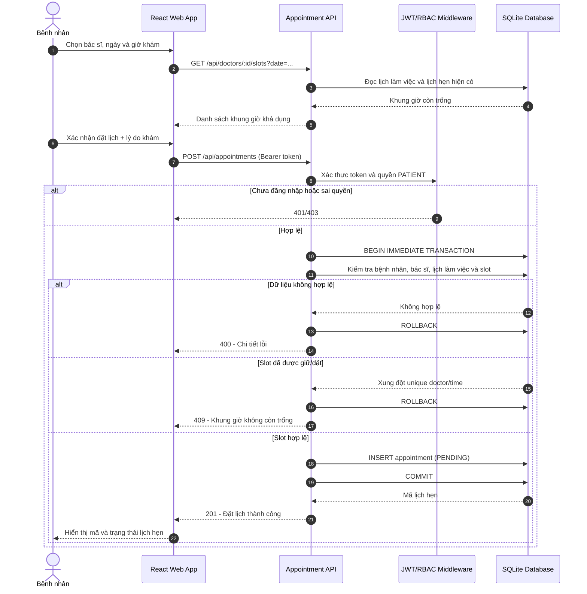

# Sequence Diagram - Đặt lịch khám nha khoa

Sơ đồ mô tả luồng đặt lịch có kiểm tra xác thực, quyền truy cập, lịch làm việc và chống trùng lịch ở phía máy chủ.

## Quy tắc quan trọng

- Bệnh nhân chỉ được đặt lịch cho chính mình; lễ tân hoặc quản trị viên có thể đặt thay.
- Thời điểm khám phải ở tương lai, nằm trong lịch làm việc của bác sĩ và đúng độ dài slot.
- Cơ sở dữ liệu có ràng buộc duy nhất theo bác sĩ và thời điểm để chặn hai yêu cầu đồng thời.
- Trạng thái hợp lệ: `PENDING -> CONFIRMED -> CHECKED_IN -> IN_PROGRESS -> COMPLETED`; có thể chuyển sang `CANCELLED` hoặc `NO_SHOW` theo quyền và thời điểm.

